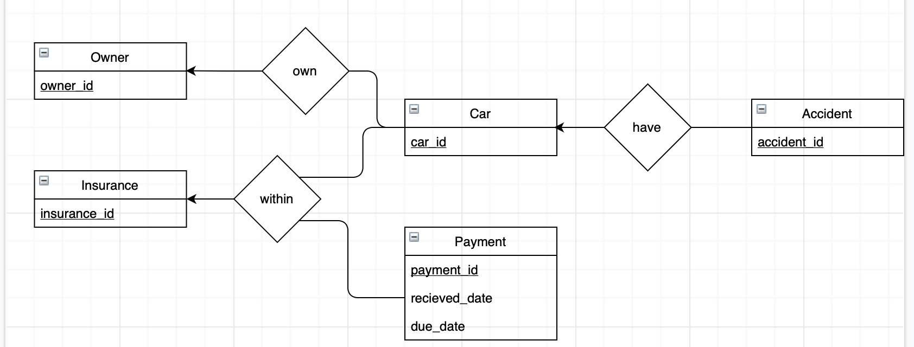
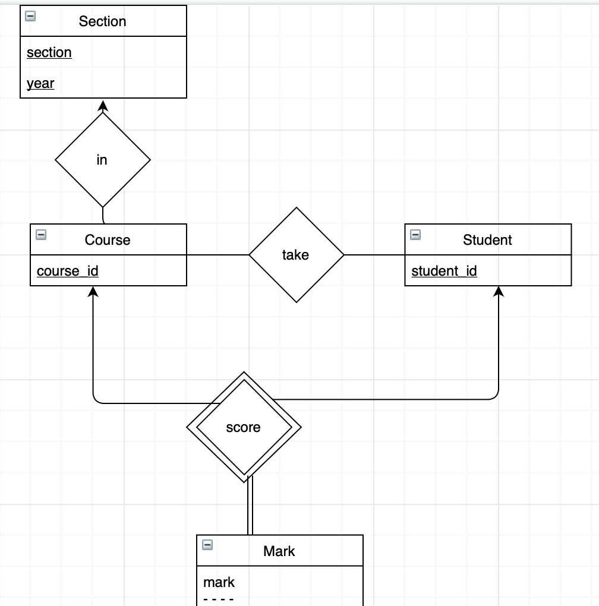
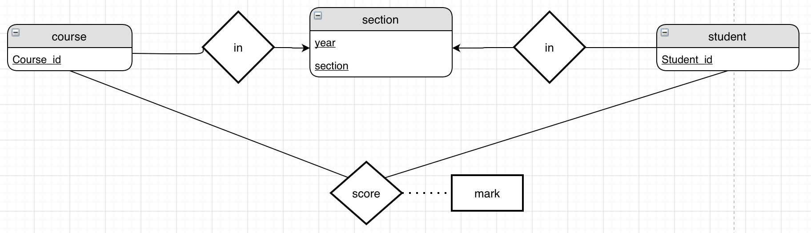
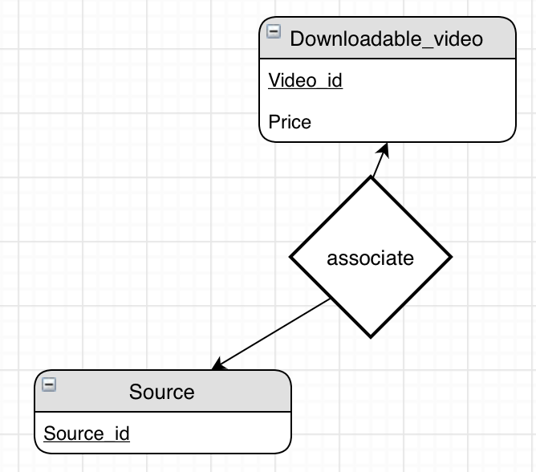
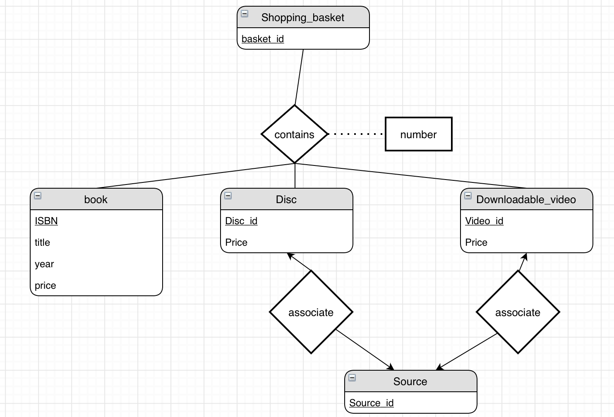
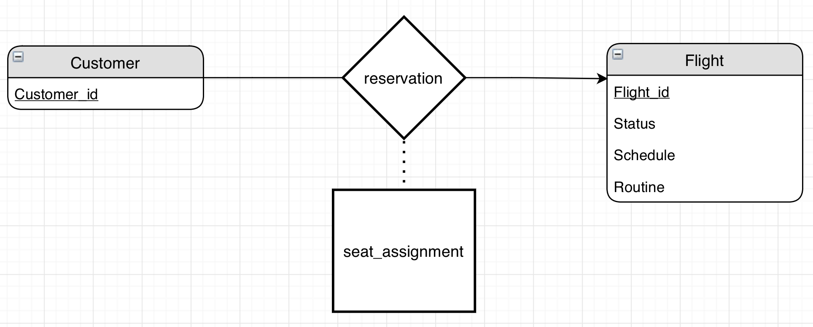

## 6.1



## 6.2 a.



## 6.2 b.



## 6.21 a.



## 6.21 b.

Other part is the same as given.



## 6.24



```mysql
create table Customer
(
    Customer_id varchar(20) primary key
)

create table Flight(
    Flight_id varchar(20) primary key,
    Status char(1),
    Schedule datetime,
    Routine varchar(20)
)

create table reservation(
    Customer_id varchar(20),
    Flight_id varchar(20),
    seat_assignment char(1),
    CONSTRAINT reservation_c 
        foreign key (Customer_id) references Customer(Customer_id),
        foreign key (Flight_id) references Flight(Flight_id)
)

```
