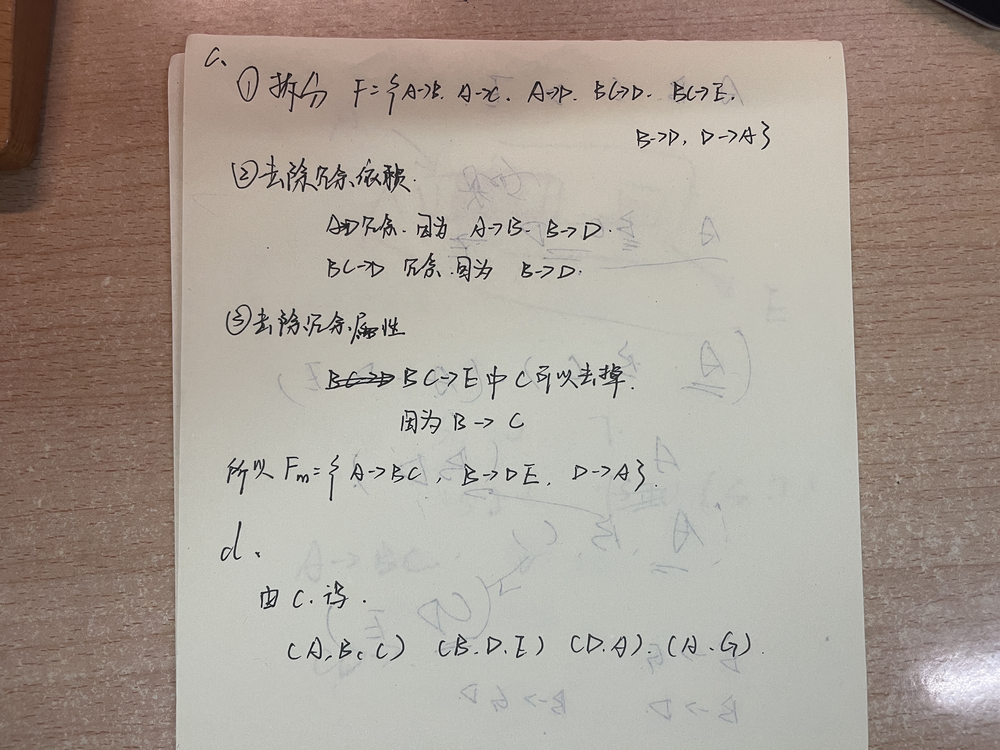

## 7.1

$$
\begin{aligned}
& (A,B,C)\cap (A,C,D)=(A)\\
& A\rightarrow BC\ so\ A\ is\ a\ super\ key\ of\ (A,B,C).\\
& B\rightarrow D\ and\ CD\rightarrow E\ so\ A\ is\ a\ super\ key\ of\ (A,D,E).\\
& Since\ it\ is\ a\ lossless\ decomposition.
\end{aligned}
$$

## 7.13

$$
\begin{aligned}
& F_1=F_1^+=\{A\rightarrow BC\}\\
& F_2=F_2^+=\{E\rightarrow A\}\\
& CD\rightarrow E\ and\ B\rightarrow E\ is\ missing\ so\ it's\ not\ a\ dependancy-preserving\ decomposition.
\end{aligned}
$$

## 7.21

  (A, B, C, E) (B, D)

## 7.22

(A, B, C) (C, D, E) (B, D) (E, A)

## 7.30

#### a.

(A, B, C, D, E)

#### b.

$$
Since\ A\rightarrow BCD,\ BC\rightarrow DE\\
A^+ = (A, B, C, D, E)\ne R \ and \ (AG)^+=R\\
So\ (AG)\ is\ a\ superkey
$$

#### c. d.

#### e.

(A, B, C, D) (A, F) (A, E)

## 7.32

#### a.

$$
A\rightarrow C\ and\ BD\rightarrow E\\
So\ AD\rightarrow E
$$

#### b. c. d.

