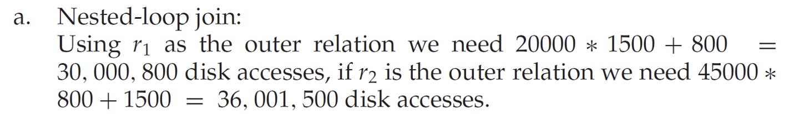

# 恢复

1. 一般的Check Point

   - redo已经提交的，从上往下，从check point到commit

   - undo没有提交的，从下往上，从最后一条log到start

2. ARIES：

   - Analysis Pass：
     - 第一步 读出所需的数据
       - 读出数据
       - RedoLSN=min(RecLSN)
       - UndoList=all not-commit txn in check point log
     - 第二步 从Check Point向后扫描
       - 有新的txn start 加入UndoList
       - 有写入 更新Dirty Page Table和该txn对应的LastLSN
       - 有txn end（commit或abort） 把这个txn从UndoList放到RedoList
   - Redo Pass：
     - 从RedoLSN开始顺序扫描直到RedoList内所有txn都commit
       - 如果RedoList内txn某update对应的页不在Dirty Page Table中或者其LSN小于对应页RecLSN，说明已经写入DIsk，不用操作
       - 否则重做写入
   - Undo Pass：
     - 从下往上Undo
     - 记得Undo要写log
     - 如果需要的话补充记录CRS，重点是UndoNextLSN指向该txn下一条需要Undo的Log

# 语句与代数式

1. 注意区别：
   - join condition：natural(默认), using(A1, A2, ...), on \<predicate\>
   - join types：inner(默认), left outer, right outer, full outer
2. 数据库所有的返回值都是**表**，包括代数操作。例如$Temp \leftarrow g_{min(score)}(student)$，Temp是一行一列的表而不是一个值；因此后续使用时应该形如$\Pi_{name}(\sigma_{age=minage}(student\bowtie(\rho _{T(minage)}(Temp))))$区分表和列（值），而不能写成$\Pi_{name}(\sigma_{age=Temp}(student))$。

# 开销估计

1. 这样写的时候不能认为r1就是外关系，应该分类讨论。

   

2. Merge Join需要讨论原表是不是有序的，不是的话需要额外加上排序的开销。