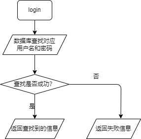
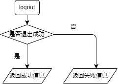
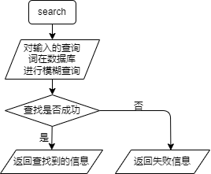
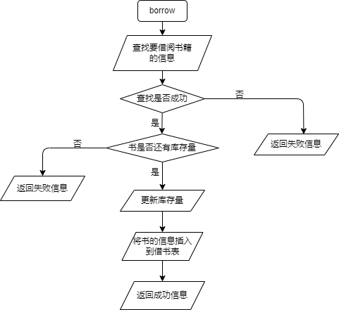
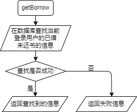
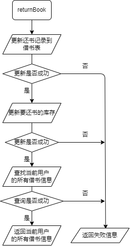
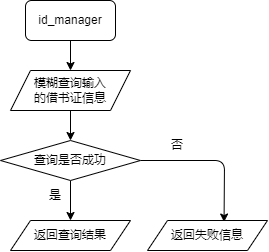
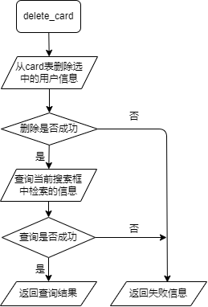
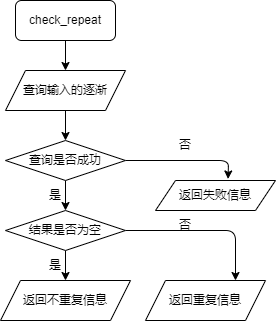
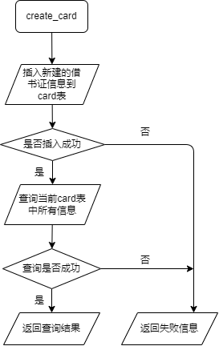

小组成员姓名：刘思锐 罗鸣明 张洮莼

# Ch.1-系统架构与功能介绍

本项目运行在浏览器环境中，采取前后端分离的整体设计。前端使用VUE3框架下的Element Plus套件实现外观效果，后端使用基于Python的Flask框架，配合pymysql库实现与数据库的交互。

## 1.1-前端部分

### 1.1.1 网站架构

网站主要分为登录页与主页两个页面。主页下包含图书借阅、还书、图书入库、借书证管理四个子页面，子页面由侧边栏控制跳转。

下图展示了进前端控制页面跳转的整体流程。


主页部分采用左右分栏设计，左侧为公用的导航栏，右侧为导航栏对应的功能页。由于采用了前后端分离的设计，前端只负责页面内容的呈现与表单数据的收集。

值得一提的是，我们对数据库结构进行了一定的改动，使非管理员也可以登录网站，但一般用户只能进行基础的查询。前端中对应的功能按钮与界面将对其自动隐藏。从下面两张图中可以看出管理员与一般用户界面的区别。


### 1.1.2 功能页面介绍

#### 1.1.2.1 图书借阅

采用上下分栏。上部为搜索内容输入框，支持任意任意条件的组合搜索，留空即该项属性不做限制。搜索时我们对用户的输入格式进行了一定的限制，例如年份只允许是整数，价格只允许是数字+小数点等，不符合格式要求的表单不允许提交。


下部展示要求的搜索结果，所有栏目均可以按照字典序升序或降序排列。仅当当前用户为管理员时借阅按钮才会出现，同时仅当库存大于0时借阅按钮允许交互。点击借阅按钮将出现输入卡号的窗口，输入的卡号在数据库中存在则记录一次借阅。


#### 1.1.2.2 还书

当前用户为管理员时还书界面如下。输入卡号（不允许为空）查询该卡号下所有未归还的书籍。可以进行还书操作。


当前用户为普通用户时还书界面如下。自动显示本卡号下已借阅未归还的书籍。还书按钮隐藏。


#### 1.1.2.3 图书入库

仅有管理员允许进入该页面。单本入库时所有条目不能为空，以书号作为书目区别的标准，书号已存在不能入库。批量入库允许选取本地txt文件进行解析，数据格式要求在此不做赘述。


#### 1.1.2.4 借书卡管理

仅有管理员允许进入该页面。允许任意条件组合查询借书卡信息，留空则该条目不做限制。查询结果同样支持排序。点击删除会有二次确认框出现。


点击借阅，查询框禁用，查询结果隐藏。新增时所有条目不能为空，以卡号作为借书卡区别的标准，卡号已存在不能新建。以下四个条目填写完成后点击创建按钮将连续出现输入密码的窗口，两次输入的密码必须相同。


## 1.2-后端部分

本节将介绍各功能模块对应的后端函数流程。

### 1.2.1 登入登出

#### 1.2.1.1 login函数

登录对应的函数，传入用户名和密码，返回登录信息。



#### 1.2.1.2 logout函数

退出系统对应的函数，返回包含是否退出成功的信息到前端。



#### 1.2.1.3 checkLogin函数

进入每一个页面都会执行这一函数，返回当前登录信息用于前端页面跳转。


### 1.2.2 图书借阅

#### 1.2.2.1 search函数

在"图书借阅"界面输入相关查询字符串后，点击查询后触发执行，传入输入的查询词，返回查询的结果。



#### 1.2.2.2 borrow函数

当管理员点击借书时触发执行，传入要借书目的信息及借书人卡号，返回数据库操作的结果。



### 1.2.3 还书

#### 1.2.3.1 getBorrow函数

当普通用户点击"还书"界面时触发执行，返回当前用户已借但尚未归还的书籍信息。



#### 1.2.3.2 returnBook函数

当管理员用户点击“还书”按钮时触发执行，传入要还书的信息，返回当前用户的借书数据。



### 1.2.4 图书入库

#### 1.2.4.1 import函数

单本图书入库对应的函数。


#### 1.2.4.2 batch函数

批量入库对应的函数。


### 1.2.5 借书证管理

#### 1.2.5.1 id_manage函数

管理员输入借书卡查询信息并点击查询后，传入相关的信息，返回查询结果。



#### 1.2.5.2 delete_card函数

管理员点击“删除”按钮触发执行，删除数据库中对应的借书证，返回删除操作的结果。



#### 1.2.5.3 check_repeat函数

当管理员创建借书卡时触发执行，查询是否已经有同值的数据存在，返回查询结果信息。



#### 1.2.5.4 create_card函数

新建借书卡时，如果确认卡号没有重复，传入创建借书证的相关信息，插入到数据库中，并返回当前数据库中的所有借书证信息。





# Ch.2-数据库结构

## 2.1-book表

book表存储书籍的所有相关信息，包括书号(bno)、类别(category)、书名(title)、出版社(press)、出版年份(year)、作者(author)、价格(price)、总量(total)、库存(stock)，其中bno是主键。

Mysql DDL语句如下：

```mysql
create table book
(
    bno      char(8)      not null
        primary key,
    category char(20)      null,
    title    varchar(40)   null,
    press    varchar(30)   null,
    year     int           null,
    author   varchar(20)   null,
    price    decimal(7, 2) null,
    total    int           null,
    stock    int           null
);
```

实际效果如下：


## 2.2-card表

card表存储借书证的相关信息，包括卡号(cno)，姓名(name)，学院/部门(department)，类别(type)，密码(password)，其中cno是主键。由于我们允许所有用户登录，所以我们在借书证表中新建了password列。类别(type)为O代表该借书证为管理员借书证，其他时候为普通用户借书证。

Mysql DDL语句如下：

```mysql
create table card
(
    cno        char(7)     not null
        primary key,
    name       varchar(10) null,
    department varchar(40) null,
    type       char        null,
    password   varchar(20) null
);
```

实际效果如下：


## 2.3-borrow表

borrow表存储关于借书和还书的相关信息，包括借书卡号(cno)、书号(bno)、借书日期(borrow_date)、还书日期(return_date)、借书经手管理员(borrow_admin)、还书经手管理员(return_admin)。如果未归还书籍，return_date和return_admin为null。

Mysql DDL语句如下：

```mysql
create table borrow
(
    cno          char(7)  null,
    bno          char(8)  null,
    borrow_date  datetime null,
    return_date  datetime null,
    borrow_admin char(7)  null,
    return_admin char(7)  null
);
```

实际效果如下：


# Ch.3-代码解析

## 3.1-前端部分

### 3.1.1 VUE3框架

相比函数式编程的react框架，VUE更像是对html的语法增强系统。由于网页开发与VUE框架的使用并不是课程内容，因此本节我将尽可能的简略。我们使用VUE框架的初衷是利用其生态下众多即取即用的样式库大大减少实现视觉效果花费的时间。本次项目使用了著名的ElementUI样式库。

```javascript
// 以下是前端工程中main.js的部分内容
// 引入element-plus与配套的CSS样式库
import ElementPlus from 'element-plus'
import 'element-plus/dist/index.css'
// 挂载 element-plus
const app = createApp(App)
app.use(ElementPlus)
```

为实现页面跳转，我们使用了VUE3原生的路由组件。项目中路由对应层级处的\<router-view />标签将会被替换为当前路由指向的页面内容。

```js
// 以下是路由的核心文件router/index.js的一部分
// 导入方法
import {createRouter, createWebHashHistory} from "vue-router";
// 创建vue文件对应的网页内容实例
const login = () => import("../components/LoginView.vue")
// 创建路由实例
const loginRoutes = [
    {
        path: "/login",	// 实际的路径
        name: "login",	// 项目内跳转的接口
        component: login // 网页的具体内容，对应前面的LoginView.vue
    }]
// 用于在外部导入的默认配置
export const loginRouter = createRouter({
    history: createWebHashHistory(),
    routes: loginRoutes
})
```

### 3.1.2 Axios库

Axios 是一个基于promise的网络请求库，我们用其简化前端向后端发送请求的代码。下面是我们进行登录验证的真实代码。

```html
<script>
    // 导包
    import axios from "axios";	// axios库
    import {loginRouter} from "@/router";	// 前一节中的路由组件
    // 发起访问请求
    axios({
      method: 'post',			// 请求的方式
      url: '/api/checkLogin'	// 请求的网址
    })
        .then((response) => { 	// 正常返回 处理后端返回的response
          console.log(response)
          if (response.data.state === 'logout') {	// 未登录
            loginRouter.push('/login')				// 返回登录页
          }
        })
        .catch((error) => {		// 中途出现了错误
          alert('出错了')
        })
</script>
```

### 3.1.3 Proxy代理

登录验证功能由后端框架附带的session实现，session依赖于cookie，而cookie在前后端分离需要跨域访问时默认不会发送，这将造成登录信息丢失，用户验证失效。解决的方法是配置proxy代理访问。下面配置的含义为，前端中所有网址以/api为开头的访问，都会被跨域代理到后端服务器。

```javascript
// 在vue.config.js中
devServer: {
    proxy: {
      '/api': {
        target: 'http://127.0.0.1:5000',// 我的后台接口域名
        ws: true,        				// 如果要代理 websockets，配置这个参数
        secure: false,  				// 如果是https接口，需要配置这个参数
        changeOrigin: true,  			// 是否跨域
        pathRewrite: {
        '^/api': '/'
      	}
      }
  	}
  }
}
```

### 3.1.4 具体应用

#### 3.1.4.1 登录验证跳转

当用户在前端输入正确的用户名和密码并点击登录后，将数据发送给后端在数据库中进行比对验证，如果验证成功将得到验证成功的返回值，此时前端将跳转到登录成功之后的页面。

```js
function login() {
  axios({
    method: 'post',
    url: '/api/login',
    data: {'username': formInline.user, 'password': formInline.password},	//将数据传入到前端
    withCredentials: true
  })
      .then((response) => {
        console.log(response)
        if (response.data.state === 'login') {		//如果接受到登录成功的信息
          loginRouter.push('/index/search')			//跳转页面
          alert('登录成功')
        } else {
          alert('用户名或密码错误')
          formInline.password = ''
        }
      })
      .catch((error) => {
        console.log(error)
      })
}
```

#### 3.1.4.2 输入格式的判断

在对图书或借书记录或借书证进行查询时，对于字符串仅判断是否是空串，对于年份价格等数字，使用正则表达式判断输入的格式是否正确。

```js
if (form.yearFrom !== '' && !/^\d+$/.test(form.yearFrom))
    alert('年份应该是一个整数')
  else if (form.yearTo !== '' && !/^\d+$/.test(form.yearTo))
    alert('年份应该是一个整数')
  else if (form.priceFrom !== '' && !/^[1-9][0-9]*([.][0-9]{1,2})?$/.test(form.priceFrom))
    alert('价格应该是一个数字 小数部分不超过两位')
  else if (form.priceTo !== '' && !/^[1-9][0-9]*([.][0-9]{1,2})?$/.test(form.priceTo))
    alert('价格应该是一个数字 小数部分不超过两位')
```

#### 3.1.4.3 管理员/普通用户的区分

在创建用户时会根据所选的用户类型判断是否是管理员。在登录时，会根据用户名查询该用户是否是管理员，并对一个变量user.isAdmin赋值。v-if为VUE框架支持的扩展属性，只有其中的变量值为真时这一标签内的内容才会进入dom树中渲染。

```html
<el-menu-item index="/index/import" v-if="user.isAdmin">
              <el-icon>
                <setting/>
              </el-icon>
              <span>图书入库</span>
            </el-menu-item>
            <el-menu-item index="/index/manager" v-if="user.isAdmin">
              <el-icon>
                <setting/>
              </el-icon>
              <span>借书卡管理</span>
            </el-menu-item>
```

```js
axios({
  method: 'post',
  url: '/api/checkLogin',
  withCredentials: true
})
    .then((response) => {
      console.log(response)
      if (response.data.state === 'logout') {
        loginRouter.push('/login')
      } else {
        user.isAdmin = response.data.isAdmin			//将数据库中的isAdmin值赋给user.isAdmin
        user.username = response.data.username
      }
    })
    .catch((error) => {
      alert('出错了')
    })

```

## 3.2 后端部分

### 3.2.1 Flask框架

Flask框架是基于python的网页后端框架，核心接口是其自带的@app.route()修饰器。开发者在修饰器中定义网址与允许的访问方式，每当有对这个网址的访问时，执行其修饰的函数并向请求方返回结果。本项目中前后端所有数据交互均以json格式进行。

```python
@app.route('/example_addr', methods=['post'])
def example_func():
    ……
    return jsonify({'request': 'succeeded'})
```

### 3.2.2 Pymysql库

Pymysql之于python，相当于ODBC之于C/C++，JDBC之于JAVA，其创建连接、创建钩子、执行语句的基本结构与课上讲的基本相似。下面是Pymysql与数据库交互的核心4步。

```python
# 第一步 创建数据库连接 参数按需填写
conn = pymysql.connect(
    host='',
    user='',
    password='',
    database=''
)
# 第二步 创建游标
cursor = conn.cursor(pymysql.cursors.DictCursor)
# 第三步 借助游标执行sql语句 sql_str变量是储存sql语句的字符串
cursor.execute(sql_str)
# 第四步 用cursor.fetchall()/fetchone()/fetchmany() 以immutablelist类型返回的sql语句结果
res = cursor.fetchone()
```

### 3.2.3 具体应用

#### 3.2.3.1 回滚

我们在所有涉及对数据库插入、删除、更新的操作中都加入了回滚机制，代码结构如下：

```python
@app.route('/rollback_example', methods=['post'])
def rollback_example():
    try:
        ...
        # 上面的语句没有发生错误 向数据库提交更改
        conn.commit()
        return jsonify({'request': 'succeeded'})
    except:
        # try中任何一个语句执行失败 跳出try进入except进行回滚
        conn.rollback()
        return jsonify({'request': 'failed', 'reason': 'databaseError'})
```

这个机制可以有效地防止对数据库的异常操作而造成的未知错误，通过返回'reason': ' '，实现前端弹出错误提示并帮助调试。

#### 3.2.3.2 模糊搜索

除登录外所有设计数据库搜索的函数都使用了通配符以实现模糊匹配：

```python
sql_str = '''SELECT bno, category, title, press, year, author, price, stock FROM book
                WHERE title like '%%{}%%' and category like '%%{}%%' and 
                    press like '%%{}%%' and author like '%%{}%%'
                '''.format(data['title'], data['category'], data['press'], data['author'])
```

我们通过使用占位符来连接MySql语句，从而进行对数据库的操作。

#### 3.2.3.3 session

Session在计算机中，尤其是在网络应用中，称为“会话控制”。Session对象存储特定用户会话所需的属性及配置信息。这样，当用户在应用程序的Web页之间跳转时，存储在Session对象中的变量将不会丢失，而是在整个用户会话中一直存在下去。我们使用session在后端记录用户登录状态。

```python
# login函数 保存session
@app.route('/login', methods=['post'])
def login():
    res = 前端传入的数据
	if 用户名及密码正确:
        # 将当前登录的用户信息存入session
        session['cno'] = res['cno']
        session['username'] = res['name']
        session['isAdmin'] = (res['type'] == 'O')
	...
    
# checkLogin函数 检查session
@app.route('/checkLogin', methods=['post'])
def checkLogin():
    # 尝试读取session 结果为空即代表当前没有登录用户
    username = session.get('username')
    isAdmin = session.get('isAdmin')
    if username is not None:
        ...
    else:
        ...
        
# logout函数 删除session
@app.route('/logout', methods=['get', 'post'])
def logout():
    # 尝试读取session 不能删除不存在的session
    remain = session['username']
    if remain is not None:
        # 删除session 即清空登录状态
        session.pop('username')
        session.pop('isAdmin')
    ...
```

#### 3.2.3.4 数据交互

前后端以json格式传递数据。

```python
# 后端从请求中获取数据
# request为前端发送的带有参数的请求
# get_json代表以json格式解析 data将是一个字典
data = request.get_json(silent=False)
```

```python
# 返还值至前端
# jsonify()函数将一个字典变量打包为json格式
return jsonify({'request': 'succeeded'})
```

# Ch.4-小组分工

- 刘思锐：前后端框架搭建、登录页实现、主页面侧边栏与搜索功能实现、对应报告章节撰写
- 罗鸣明：借书证管理功能实现、项目调试、对应章节报告撰写
- 张洮莼：图书入库功能实现、借书还书功能实现、对应章节报告撰写

